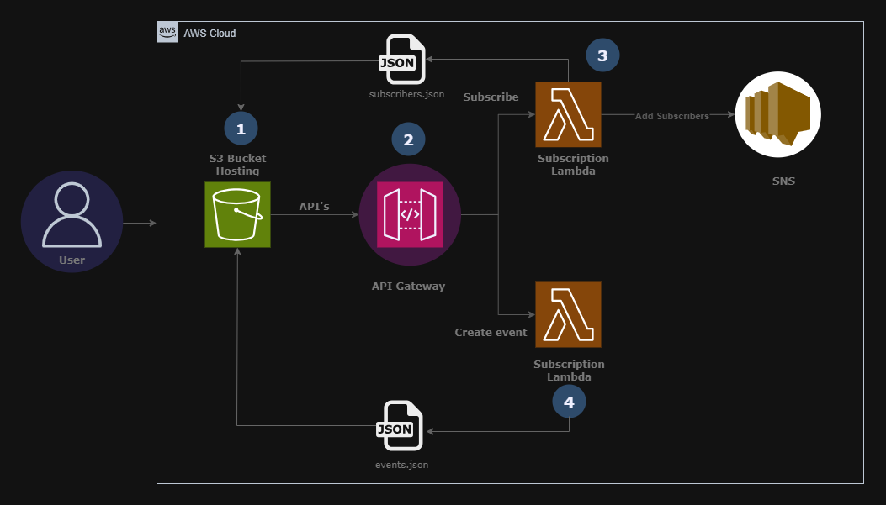

# Event Notification System - AWS Serverless

## Arquitetura do Sistema



## Descrição da Arquitetura

O diagrama ilustra uma arquitetura serverless completa na AWS para um sistema de notificação de eventos:

### Componentes da Arquitetura:

1. **Front-end Web/Mobile**
   - Interface do usuário que consome a API
   - Pode ser uma SPA, aplicativo móvel ou site estático

2. **Amazon API Gateway**
   - Entrada única para todas as requisições HTTP
   - Roteamento para as funções Lambda apropriadas
   - Gerenciamento de autenticação e throttling

3. **AWS Lambda Functions**
   - `create-event`: Processa criação de novos eventos
   - `subscribe`: Gerencia inscrições de e-mail

4. **Amazon S3 (Simple Storage Service)**
   - Armazena `events.json` com todos os eventos cadastrados
   - Armazena `subscribers.json` com a lista de e-mails inscritos

5. **Amazon SNS (Simple Notification Service)**
   - Tópico para notificações de novos eventos
   - Gerenciamento de inscrições por e-mail
   - Envio de notificações para todos os inscritos

### Fluxo de Dados:

1. **Cadastro de Evento**:
   - Front-end → API Gateway → Lambda `create-event` → S3 (events.json) → SNS → Inscritos

2. **Inscrição de E-mail**:
   - Front-end → API Gateway → Lambda `subscribe` → S3 (subscribers.json) → SNS (nova inscrição)

## Serviços AWS Utilizados e Suas Funções

### AWS Lambda
**Função**: Execução de código sem provisionar ou gerenciar servidores  
**Por que usamos**: 
- Escalabilidade automática baseada na demanda
- Cobrança apenas pelo tempo de execução
- Integração nativa com outros serviços AWS
- Execução de lógica de negócio em resposta a eventos

### Amazon S3 (Simple Storage Service)
**Função**: Armazenamento persistente de dados  
**Por que usamos**:
- Armazenamento durável de JSON com eventos e inscritos
- Alta disponibilidade (99.99%)
- Baixo custo para armazenamento de dados
- Acesso via API simples e bem documentada

### Amazon SNS (Simple Notification Service)
**Função**: Sistema de mensagens pub/sub (publicação/assinatura)  
**Por que usamos**:
- Notificação eficiente para múltiplos inscritos
- Confirmação de inscrição por e-mail (double opt-in)
- Gerenciamento automático de bounce e unsubscribe
- Alta escalabilidade para envio de mensagens

### API Gateway
**Função**: Gerenciamento e criação de APIs RESTful  
**Por que usamos**:
- Exposição segura das funções Lambda como endpoints HTTP
- Gerenciamento de autenticação, throttling e caching
- Transformação de requisições HTTP em eventos Lambda
- Facilidade de versionamento e deploy de APIs

## Funções Lambda Explicadas

### Função create-event
**Propósito**: Processar a criação de novos eventos e notificar inscritos  
**Fluxo**:
1. Recebe payload JSON com título e data do evento
2. Valida os dados de entrada
3. Recupera a lista atual de eventos do S3
4. Adiciona o novo evento à lista
5. Persiste a lista atualizada no S3
6. Publica notificação no tópico SNS
7. Retorna resposta apropriada para o cliente

### Função subscribe
**Propósito**: Gerenciar inscrições de e-mail para notificações  
**Fluxo**:
1. Recebe e-mail para inscrição
2. Valida o formato do e-mail
3. Recupera lista atual de inscritos do S3
4. Adiciona o e-mail se não existir
5. Persiste a lista atualizada no S3
6. Cria inscrição no tópico SNS
7. Retorna resposta de sucesso

## Possibilidades de Integração com Front-end

### 1. Aplicação Web Single-Page (SPA)
**Tecnologias**: React, Vue.js, Angular  
**Integração**:
```javascript
// Exemplo de chamada para criar evento
const createEvent = async (eventData) => {
  const response = await fetch('https://api-gateway-url/create-event', {
    method: 'POST',
    headers: { 'Content-Type': 'application/json' },
    body: JSON.stringify(eventData)
  });
  return response.json();
};

// Exemplo de chamada para inscrever e-mail
const subscribeEmail = async (email) => {
  const response = await fetch('https://api-gateway-url/subscribe', {
    method: 'POST',
    headers: { 'Content-Type': 'application/json' },
    body: JSON.stringify({ email })
  });
  return response.json();
};
```

### 2. Aplicativo Mobile
**Plataformas**: iOS, Android, React Native, Flutter  
**Integração**:
- Chamadas HTTP para os endpoints da API Gateway
- Tratamento de estados de carregamento e erro
- Armazenamento local de dados se necessário

### 3. Site Estático (HTML/CSS/JS)
**Hospedagem**: Amazon S3, CloudFront, Netlify, Vercel  
**Vantagens**:
- Baixo custo de hospedagem
- Alta escalabilidade
- Fácil implantação

### 4. Framework Full-Stack
**Opções**: Next.js, Nuxt.js, SvelteKit  
**Vantagens**:
- Renderização no servidor para melhor SEO
- Geração de páginas estáticas
- API routes para funcionalidades adicionais

### 5. Funcionalidades de Front-end Possíveis
- Listagem de eventos cadastrados
- Formulário de inscrição para notificações
- Página de criação de eventos
- Dashboard administrativo
- Confirmação de inscrição via e-mail
- Cancelamento de inscrição

## Considerações de Implementação

### Segurança
- Validação de entrada em ambas as extremidades
- Uso de HTTPS para todas as comunicações
- Configuração adequada de CORS no API Gateway
- Políticas IAM com privilégios mínimos necessários

### Performance
- Cache de respostas no API Gateway
- Otimização do código Lambda (conexões persistentes)
- Compressão de dados nas respostas

### Monitoramento
- Configuração de CloudWatch para logs e métricas
- Alertas para erros e throttling
- Rastreamento de desempenho com X-Ray

Esta arquitetura oferece uma base sólida e escalável para um sistema de notificação de eventos, com diversas opções de integração front-end adequadas para diferentes cenários e necessidades.